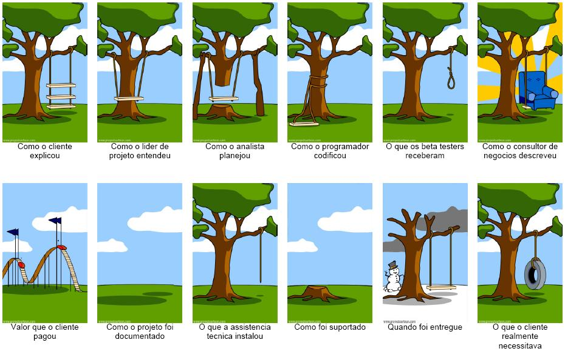

# Princípios da Comunicação
### Engenharia de Requisitos – Módulo 1
#### Prof. Lucas Henrique de Abreu

---

<!--  -->

---

## Comunicação na Engenharia de Requisitos

- A maioria dos erros em software ocorre por falhas de comunicação
- É o elo entre stakeholders e equipe técnica
- Base para requisitos claros, validados e úteis

[Fonte: Gustavo Caetano]

---

## Principais Problemas de Comunicação

- Ambiguidade: “rápido”, “fácil”, “melhor”
- Desalinhamento entre o que é dito e entendido
- Jargões técnicos vs. linguagem do usuário
- Falta de validação e registro

[Fonte: IEEE Std 830-1998]

---

## Princípios de Comunicação (1–5)

1. **Clareza e objetividade**  
   Requisitos devem ser diretos e compreensíveis

2. **Escuta ativa**  
   Entenda antes de registrar – atenção ao que é dito

---

3. **Evitar ruídos**  
   Reduza ambiguidades e barreiras de linguagem

4. **Linguagem estruturada**  
   Ex: “O sistema deve gerar relatório em PDF ao final do mês”

5. **Validação com stakeholders**  
   O que foi entendido precisa ser confirmado

---

## Princípios de Comunicação (6–10)

6. **Feedback constante**  
   Revise requisitos frequentemente com o cliente

7. **Comunicação adaptada ao perfil**  
   Ajuste linguagem e abordagem ao público

---

8. **Colaboração bidirecional**  
   Requisitos são construídos em conjunto

9. **Registro formal**  
   Documente decisões e requisitos acordados

10. **Transparência**  
    Comunique limitações, riscos e mudanças

---

## Técnicas de Comunicação Eficiente

- Roteiros de entrevista
- Reuniões com ata
- Prototipação e storytelling
- User stories com critérios de aceitação
- Revisões iterativas com feedback

---

## Estudo de Caso – Comunicação Ruim

> O sistema deve ser rápido ao processar pedidos.

### Problemas:
- Vago: o que é “rápido”?
- Critério não mensurável

### Forma melhorada:
> O sistema deve processar pedidos em até 3 segundos após o envio, em 95% dos casos.

---

## Exercício em Sala

- Formem duplas: analista e stakeholder
- Criem um requisito funcional
- Apliquem os princípios para melhorá-lo
- Apresentem antes e depois para a turma

---

## Leitura Recomendada

- *Software Requirements* – Karl Wiegers
- IEEE Std 830
- [10 Princípios da Comunicação – Gustavo Caetano](https://www.youtube.com/watch?v=iC-hVnwlzUU)