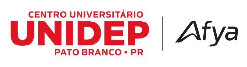

# **Engenharia de Requisitos de Software**
### Apresentação da Disciplina
##### Prof. Lucas Henrique de Abreu

---

## Descrição da Disciplina

Apresenta os fundamentos, processos, técnicas e ferramentas para elicitação, modelagem, validação e gerenciamento de requisitos.

Combina teoria e prática com ferramentas de mercado, preparando o aluno para atuar em projetos reais de software.

---

## Objetivos da Disciplina

1. Compreender a importância dos requisitos no desenvolvimento de software
2. Aplicar técnicas de levantamento com diferentes stakeholders
3. Modelar e especificar requisitos de forma clara e organizada
4. Validar e gerenciar requisitos de forma contínua
5. Utilizar ferramentas como Jira, RequisitePro, Confluence e similares

---

## Competências Desenvolvidas

- Levantamento estruturado com usuários e clientes
- Modelagem com UML e escrita de user stories
- Gerenciamento de backlog e mudanças
- Validação com critérios claros
- Rastreabilidade e documentação viva

---

## Plano de Ensino

### Módulo 1 – Introdução
- Conceitos, tipos de requisitos e ciclo de vida
- Princípios da Comunicação

### Módulo 2 – Processos e Modelos
- Abordagens preditivas e ágeis

---

### Módulo 3 – Técnicas de Elicitação
- Entrevistas, observação, prototipação

### Módulo 4 – Modelagem de Requisitos
- Casos de uso, atividades e ferramentas visuais

---

### Módulo 5 – Especificação e Documentação
- Padrões, linguagem estruturada, critérios de qualidade

### Módulo 6 – Validação e Verificação
- Revisão, testes baseados em requisitos

---

### Módulo 7 – Gerenciamento
- Priorização, mudanças, rastreabilidade

### Módulo 8 – Ferramentas e Estudos de Caso
- Aplicação com Jira, RequisitePro, projeto final

---

## Atividades Práticas

- Jogo de papéis com stakeholders simulados
- Modelagem UML e user stories
- Backlog em Jira com priorização
- Validação de requisitos reais
- Projeto final com entrega completa

---

## Bibliografia Básica

- Sommerville, *Engenharia de Software*
- Pressman & Maxim, *Engenharia de Software Profissional*
- Kroenke & Auer, *Análise Essencial de Sistemas*

---

## Bibliografia Complementar

- Paula Filho, *Engenharia de Requisitos*
- Wiegers & Beatty, *Software Requirements*
- Leffingwell, *Agile Software Requirements*
- Albert, *Engenharia de Requisitos Ágeis*

---

## Obras Recomendadas de Robert C. Martin

- *Código Limpo*
- *Arquitetura Limpa*
- *Desenvolvimento Ágil Limpo*

---